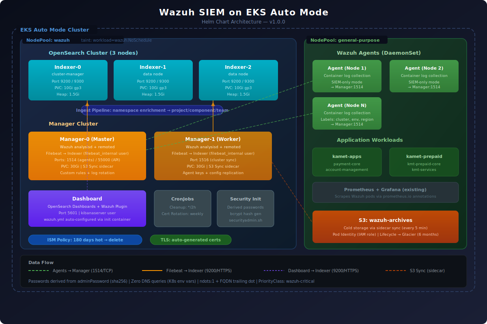

# Wazuh Helm Chart

Production-ready [Wazuh](https://wazuh.com/) SIEM deployment for Kubernetes, optimized for **EKS Auto Mode**.

## Architecture



## Components

| Component | Type | Description |
|-----------|------|-------------|
| **Indexer** | StatefulSet (3 replicas) | OpenSearch cluster with quorum for alert/archive storage |
| **Manager** | StatefulSet (master + worker) | Wazuh Manager cluster with Filebeat for log processing |
| **Dashboard** | Deployment | Wazuh Dashboard (OpenSearch Dashboards) web UI |
| **Agent** | DaemonSet | Wazuh Agent on every node for log collection |
| **Certs Generator** | Job (pre-install) | Auto-generates TLS certificates |
| **Security Init** | Init container (indexer) | Configures users, passwords, and roles automatically |
| **S3 Sync** | Sidecar (optional) | Syncs archives to S3 for cold storage |
| **Cert Rotation** | CronJob (optional) | Rotates TLS certificates before expiration |
| **Cleanup** | CronJob (optional) | Cleans vd_updater temp files (4.14.x workaround) |

## Quick Start

### Prerequisites

- Kubernetes 1.28+
- Helm 3.x
- A StorageClass with dynamic provisioning (default: `gp3` with EBS CSI)

### Install

```bash
# Add the repo
helm repo add wazuh-helm https://ileonelperea.github.io/wazuh-helm
helm repo update

# Install with default values
helm install wazuh wazuh-helm/wazuh -n wazuh --create-namespace

# Or from source with custom values
git clone https://github.com/ileonelperea/wazuh-helm.git
cd wazuh-helm
helm install wazuh . -n wazuh --create-namespace -f my-values.yaml
```

### Minimal custom values

```yaml
# my-values.yaml
global:
  timezone: "America/Mexico_City"

security:
  adminPassword: "YourSecurePassword123!"
```

That's it. Internal passwords (kibanaserver, filebeat, API) are **derived automatically** from `adminPassword`. No hashes, no manual setup.

### Access the Dashboard

```bash
kubectl port-forward svc/wazuh-dashboard 5601:5601 -n wazuh

# Open: http://localhost:5601
# Login: admin / <your adminPassword>
```

## Configuration

### Global

| Parameter | Description | Default |
|-----------|-------------|---------|
| `global.timezone` | Timezone for all containers | `"UTC"` |

### Security

| Parameter | Description | Default |
|-----------|-------------|---------|
| `security.adminPassword` | Admin password — **required** when `vault.enabled=false` | `"SecurePassword123!"` |
| `security.existingSecrets.indexer` | Use existing Secret for indexer credentials | `""` |
| `security.existingSecrets.api` | Use existing Secret for API credentials | `""` |
| `security.existingSecrets.dashboard` | Use existing Secret for dashboard credentials | `""` |
| `security.existingSecrets.filebeat` | Use existing Secret for filebeat credentials | `""` |

> Internal passwords (kibanaserver, filebeat, API) are derived deterministically from `adminPassword` using SHA-256. You never need to set them manually.
> When `vault.enabled=true` and `vault.readAdminPasswordFromVault=true`, `adminPassword` is not required — the chart reads the password directly from Vault KV.

### Indexer

| Parameter | Description | Default |
|-----------|-------------|---------|
| `indexer.replicas` | Number of indexer replicas (3 recommended for quorum) | `3` |
| `indexer.resources.requests.memory` | Memory request | `2Gi` |
| `indexer.resources.limits.memory` | Memory limit | `3Gi` |
| `indexer.javaOpts` | JVM heap (keep ≤ 50% of memory limit) | `"-Xms1536m -Xmx1536m"` |
| `indexer.storage.size` | PVC size | `10Gi` |
| `indexer.nodeSelector` | Node selector for dedicated nodes | `{}` |
| `indexer.tolerations` | Tolerations for tainted nodes | `[]` |

### Manager

| Parameter | Description | Default |
|-----------|-------------|---------|
| `manager.replicas` | Number of manager replicas | `2` |
| `manager.cluster.enabled` | Enable manager cluster mode | `true` |
| `manager.storage.size` | PVC size (30Gi+ recommended) | `30Gi` |
| `manager.feedUpdateInterval` | Vulnerability feed update interval | `"12h"` |
| `manager.logallJson` | Log all events to archives | `true` |
| `manager.nodeSelector` | Node selector for dedicated nodes | `{}` |
| `manager.tolerations` | Tolerations for tainted nodes | `[]` |

### Dashboard

| Parameter | Description | Default |
|-----------|-------------|---------|
| `dashboard.replicas` | Number of dashboard replicas | `1` |
| `dashboard.ingress.enabled` | Enable Ingress for external access | `false` |
| `dashboard.ingress.host` | Dashboard hostname | `"wazuh.example.com"` |
| `dashboard.service.annotations` | Annotations on the dashboard Service (ExternalDNS, AWS LB Controller, etc.) | `{}` |
| `dashboard.nodeSelector` | Node selector for dedicated nodes | `{}` |
| `dashboard.tolerations` | Tolerations for tainted nodes | `[]` |

**ExternalDNS example:**
```yaml
dashboard:
  service:
    annotations:
      external-dns.alpha.kubernetes.io/hostname: wazuh.example.com
```

### Agent

| Parameter | Description | Default |
|-----------|-------------|---------|
| `agent.enabled` | Deploy agent DaemonSet | `true` |
| `agent.monitoredNamespaces` | Namespaces to monitor (empty = all) | `[]` |
| `agent.siemOnly` | Disable infra monitoring (use with Prometheus) | `true` |
| `agent.labels` | Labels injected into every event | `{}` |
| `agent.namespaceMapping` | Map namespaces to project/component labels | `{}` |

### Agent Labels & Namespace Mapping

```yaml
agent:
  labels:
    cluster: "my-cluster"
    environment: "production"
    region: "us-east-1"

  namespaceMapping:
    my-app:
      project: "myproject"
      component: "backend"
      team: "backend-team"
    my-frontend:
      project: "myproject"
      component: "frontend"
      team: "frontend-team"
```

Events are automatically enriched with these labels in OpenSearch via an ingest pipeline.

### S3 Archive Sync

| Parameter | Description | Default |
|-----------|-------------|---------|
| `s3.enabled` | Enable S3 archive sidecar | `false` |
| `s3.bucket` | S3 bucket name | `""` |
| `s3.region` | AWS region | `"us-east-1"` |
| `s3.syncIntervalSeconds` | Sync interval in seconds | `300` |

> Requires IAM permissions. On EKS, use [Pod Identity](https://docs.aws.amazon.com/eks/latest/userguide/pod-identities.html) to grant the `wazuh-manager` ServiceAccount access to your S3 bucket.

### Cert Rotation

| Parameter | Description | Default |
|-----------|-------------|---------|
| `certs.rotation.enabled` | Enable automatic cert rotation CronJob | `false` |
| `certs.rotation.schedule` | Cron schedule for rotation check | `"0 2 1 * *"` |
| `certs.rotation.daysBeforeExpiry` | Days before expiry to trigger rotation | `30` |
| `certs.validityDays` | Certificate validity in days | `1825` |

### Node Isolation (EKS Auto Mode)

For dedicated Wazuh nodes with Karpenter:

```yaml
# Create a NodePool with taint
apiVersion: karpenter.sh/v1
kind: NodePool
metadata:
  name: wazuh
spec:
  template:
    metadata:
      labels:
        workload: wazuh
    spec:
      taints:
        - key: workload
          value: wazuh
          effect: NoSchedule
      # ... requirements

# In your values.yaml
indexer:
  nodeSelector:
    workload: wazuh
  tolerations:
    - key: workload
      value: wazuh
      effect: NoSchedule
manager:
  nodeSelector:
    workload: wazuh
  tolerations:
    - key: workload
      value: wazuh
      effect: NoSchedule
dashboard:
  nodeSelector:
    workload: wazuh
  tolerations:
    - key: workload
      value: wazuh
      effect: NoSchedule
# Agents do NOT get nodeSelector — they run on all nodes
```

### Vault Integration

The chart supports three credential management modes:

**Mode 1 — No Vault (default, simplest)**
Set `security.adminPassword` and all secrets are created as Kubernetes Secrets automatically.

**Mode 2 — Vault bootstrap (first install)**
```yaml
vault:
  enabled: true
  address: "http://vault.vault.svc.cluster.local:8200"
  bootstrap:
    enabled: true
    bootstrapToken: "<your-vault-root-or-admin-token>"
security:
  adminPassword: "YourSecurePassword123!"
```
The pre-install Job seeds the password into Vault KV and configures Kubernetes auth. After this, set `bootstrap.enabled: false` and remove `adminPassword` from your values.

**Mode 3 — Vault post-bootstrap (subsequent upgrades)**
```yaml
vault:
  enabled: true
  address: "http://vault.vault.svc.cluster.local:8200"
  readAdminPasswordFromVault: true  # password comes from Vault KV, not values
  bootstrap:
    enabled: false
```
No credentials in your values file. ESO syncs all secrets from Vault automatically.

| Parameter | Description | Default |
|-----------|-------------|---------|
| `vault.enabled` | Enable Vault + ESO integration | `false` |
| `vault.address` | Vault server address | `""` |
| `vault.readAdminPasswordFromVault` | Read admin password from Vault KV instead of values | `false` |
| `vault.bootstrap.enabled` | Run bootstrap Job on install/upgrade | `false` |
| `vault.bootstrap.bootstrapToken` | Token used to configure Vault (required when bootstrap.enabled=true) | `""` |
| `vault.role` | Vault Kubernetes auth role | `"wazuh"` |
| `vault.mount` | Vault KV v2 mount path | `"wazuh"` |
| `vault.refreshInterval` | ESO secret refresh interval | `"1h"` |

### Prometheus Metrics

The chart includes an optional [OpenSearch Exporter](https://github.com/prometheus-community/elasticsearch_exporter) sidecar on each indexer pod.

| Parameter | Description | Default |
|-----------|-------------|---------|
| `indexer.exporter.enabled` | Enable Prometheus OpenSearch exporter sidecar | `false` |
| `networkPolicy.prometheusNamespace` | Namespace of Prometheus (restricts scraping NetworkPolicy) | `""` |

```yaml
indexer:
  exporter:
    enabled: true

networkPolicy:
  enabled: true
  prometheusNamespace: "monitoring"  # leave empty to allow scraping from any namespace
```

Metrics are exposed on `:9108/metrics` with certificate-based auth to OpenSearch.

### Network Policies

| Parameter | Description | Default |
|-----------|-------------|---------|
| `networkPolicy.enabled` | Enable Kubernetes NetworkPolicies for all components | `false` |
| `networkPolicy.prometheusNamespace` | Namespace label for Prometheus scraping (empty = allow all) | `""` |

## EKS Auto Mode Notes

- **StorageClass**: Uses `ebs.csi.eks.amazonaws.com` (not legacy `kubernetes.io/aws-ebs`)
- **vm.max_map_count**: Bottlerocket nodes have `524288` by default
- **CoreDNS**: Runs as systemd on nodes, not as K8s pod. Chart uses FQDN + `ndots:1` to minimize DNS queries
- **Pod Identity**: Recommended for S3 access
- **Karpenter**: Set `consolidateAfter: 10m` to avoid aggressive node recycling

## Data Retention

| Tier | Retention | Storage |
|------|-----------|---------|
| **Dashboard** (OpenSearch) | 180 days (ISM policy) | Indexer PVCs |
| **S3 Standard** | 6 months | S3 bucket |
| **S3 Glacier** | Indefinite | S3 Lifecycle rule |

## Troubleshooting

### Dashboard shows "No matching indices for wazuh-alerts-*"

Normal on first install. Alerts are generated when agents detect events matching rules (rootcheck, SCA, syscheck). First alerts appear within hours.

### Indexer not passing readiness probe

The security init container must complete before the indexer is ready. Check init container logs:
```bash
kubectl logs -n wazuh wazuh-indexer-0 -c security-config
```

### Agent stuck in Init

The agent init container resolves the manager service via environment variable. If stuck, check that the manager service exists:
```bash
kubectl get svc -n wazuh | grep manager
```

### Manager disk filling up

The vulnerability detector in 4.14.x creates temp files that aren't cleaned. Enable cleanup CronJob (`cleanup.enabled: true`) and set `feedUpdateInterval: "12h"`.

### DNS issues on EKS Auto Mode

CoreDNS runs as systemd. If a node has DNS issues, the chart uses Kubernetes service environment variables to avoid DNS dependency. Debug with:
```bash
kubectl run dns-test --image=public.ecr.aws/docker/library/busybox:1.36 --rm -i --restart=Never --overrides='{"spec":{"nodeName":"NODE_NAME"}}' -- nslookup kubernetes.default.svc.cluster.local.
```

## CI Pipeline

The chart includes a GitHub Actions workflow that validates on every push/PR:

1. `helm lint` — Syntax validation
2. `helm template` + `kubeconform` — K8s schema validation
3. `kube-score` — Best practices analysis
4. `pluto` — Deprecated API detection
5. `trivy` — Security misconfiguration scanning
6. `ct lint` — Chart testing

## License

MIT — see [LICENSE](LICENSE) for details.
